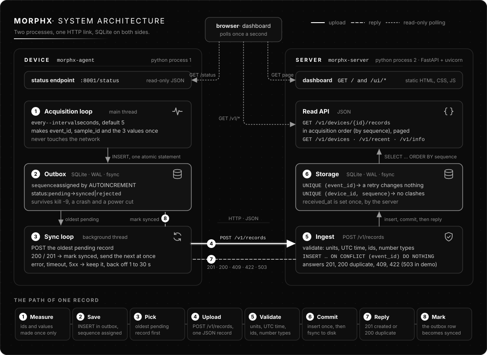
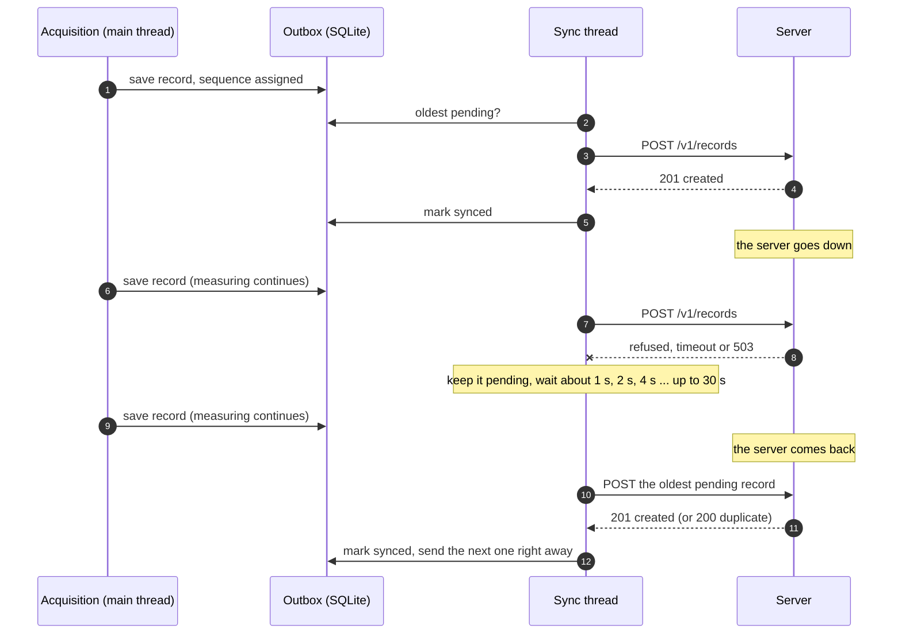
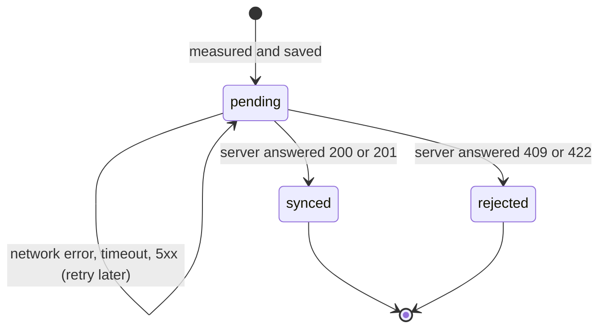
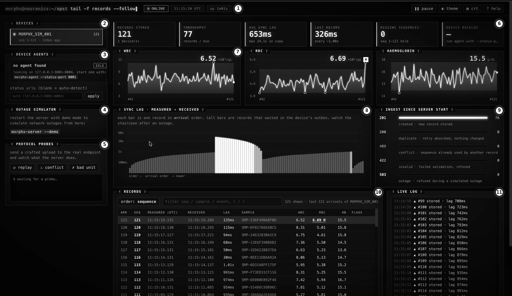

# MorphX device simulator

[](https://github.com/mirinae603/morphx-sim/actions/workflows/ci.yml)

My take on the Neuranics Lab assignment: a pretend MorphX diagnostic device and the server it reports to.

- The **agent** (the device) makes one synthetic blood count (WBC, RBC, haemoglobin) every 5 seconds,
  saves it to a local database first, and uploads it in the background.
- The **server** receives the results over HTTP, stores them in SQLite and lets you read them back per
  device in the order they were measured. It also serves a small web dashboard.

They are two separate processes. If the server or the network goes away, the agent keeps measuring,
and everything that piled up is sent automatically once the server is back. Nothing is lost and
nothing is stored twice.

**Jump to:** [Architecture](#architecture) · [Setup](#setup) · [Try an outage](#try-an-outage) ·
[Dashboard](#dashboard) · [The record](#the-record) · [API](#api) · [How it works](#how-it-works) ·
[Configuration](#configuration) · [Tests](#tests-and-checks) · [Looking at the data](#looking-at-the-data) ·
[Troubleshooting](#troubleshooting) · [Limitations](#limitations)

## Architecture



The numbers on the diagram follow one record from measurement to storage and back:

1. The **acquisition loop** (main thread) makes a test. Its `event_id`, `sample_id` and the three values are created once. It never touches the network, so a dead or slow server can't hold it up.
2. The record is saved in the **outbox**, a SQLite file. `sequence` comes from the database in the same statement that saves the record, so numbering carries on across restarts and crashes.
3. The **sync loop** (a background thread) picks the oldest pending record.
4. It uploads the record to the server with `POST /v1/records`.
5. **Ingest** validates it (units, UTC time, ids, number types) and inserts it. A repeat of an `event_id` the server already has changes nothing.
6. **Storage** commits to disk before the server answers, so an acknowledged record survives a crash.
7. The server replies `201 created` or `200 duplicate` (or an error code).
8. Only then does the sync loop mark the record `synced` in the outbox. Errors are retried with backoff instead.

The dotted lines are the browser dashboard polling the server's read API and the agent's small read-only
status endpoint once a second.

What happens during an outage, step by step:



Every record goes through three states on the device:



## Setup

**You need:** Python 3.11 or newer, on macOS or Linux. The `sqlite3` command
is optional, for poking at the databases.

Run everything from the project folder (`morphx-sim`). The programs keep their data in a `data/` folder
*relative to where you start them*, so always start both from the same place.

**1. Install** (once):

```bash
cd morphx-sim
python3 --version
```

```bash
python3 -m venv .venv
```

```bash
source .venv/bin/activate
```

```bash
pip install -e ".[dev]"
```

This installs FastAPI, uvicorn, httpx and pydantic, plus pytest and ruff for the tests. Activate the
virtual environment (`source .venv/bin/activate`) in every new terminal.

**2. Start the server** (terminal 1). `--demo` adds the outage buttons to the dashboard:

```bash
morphx-server --demo
```

It listens on http://127.0.0.1:8000 and logs the full path of its database (`data/server.sqlite3`).

**3. Start a device** (terminal 2). `--interval 1` makes it measure every second instead of every 5, and
`--status-port 8001` lets the dashboard see the agent:

```bash
morphx-agent --interval 1 --status-port 8001
```

You should see `measured sequence 1`, `synced sequence 1`, `measured sequence 2`, and so on.

**4. Open the dashboard:** http://127.0.0.1:8000

**Optional: more devices.** Each one needs its own id and status port:

```bash
morphx-agent --device-id MORPHX_SIM_002 --interval 2 --status-port 8002
```

**Stop:** press Ctrl-C in each terminal. The agent finishes the upload in flight and exits; anything
unsent goes out the next time it starts.

**Start from scratch:** stop both programs, then delete the data of *both*:

```bash
rm -rf data
```

(If you wipe only one side you will see `409` conflicts, see [Troubleshooting](#troubleshooting).)

With no flags, `morphx-server` and `morphx-agent` run the plain assignment setup: one record every 5
seconds, no outage buttons, no status page.

## Try an outage

**From the dashboard.** With `--demo` on, click **⚡ 30s** in the *outage simulator* panel. For the next
30 seconds the server answers every upload with `503`. Watch:

- the top bar changes to `SIMULATED OUTAGE`, the agent turns **OFFLINE · retry …s** and its *pending* count grows;
- the live log says the agent cannot reach the server, but it keeps logging that it is measuring;
- when the 30 seconds are up, the log reports a **backlog flush**, pending goes back to 0 and the lag chart shows a tall staircase: those are the records that waited in the outbox.

**From the terminal.** Press Ctrl-C in the server's terminal, wait ten seconds and look at the agent
log: it keeps printing `measured sequence …` and warns that the server is unreachable. Start the server
again and the backlog goes through by itself, usually within about 10 seconds because of the retry backoff.

**Crash the device** instead:

```bash
pkill -9 -f morphx-agent
```

Start the agent again and the next measurement is the old sequence plus one, not 1.

## Dashboard



*Plain screenshot without the markers: [dashboard.webp](docs/images/dashboard.webp). It was taken with the
agent running without `--status-port` and the server without `--demo`, which is why panels 3 and 4 show
hints instead of live controls. The white block in the lag chart is a backlog: the server had been
unreachable for about 24 seconds and those records waited in the outbox.*

| # | Panel | What it shows and how to read it |
|---|---|---|
| 1 | **Top bar** | Connection chip: `ONLINE`, `LINK LOST` (the page can't reach the server), `PAUSED` or `SIMULATED OUTAGE n s`. Then the server's clock (UTC), its uptime and a `DEMO MODE` chip. Buttons: pause live updates, change theme, toggle the CRT effect, help. |
| 2 | **Devices** | Every device that has reported, with its record count, the range of sequences held and the time since its last record. The dot shows how recent that is. A `n missing` badge means some sequence numbers in the range haven't arrived. Click to select a device. |
| 3 | **Device agents** | The agents found on ports 8001 to 8004 (or the URLs you type in). `ONLINE`, or `OFFLINE · retry 4s` with the last error. The bar is synced (white) against pending (hatched), with counts for pending, synced and rejected. |
| 4 | **Outage simulator** | Only with `--demo`: ⚡ 10s, 30s and 60s make the server answer uploads with `503`, `restore` ends it. Without `--demo` this panel just tells you how to enable it. |
| 5 | **Protocol probes** | Sends a crafted upload to the real endpoint and prints the answer. `replay` re-sends the newest record (`200 duplicate`), `conflict` reuses its sequence under a new id (`409`), `bad unit` sends `g/L` (`422`). |
| 6 | **KPI cards** | *Records stored*: all devices. *Throughput*: records per minute over the last 60 s. *Avg sync lag*: mean of received minus measured over the last 30 records, with the maximum in view. *Last record*: time since the selected device's latest record, which turns grey and then white as it gets overdue. *Missing sequences*: numbers inside the device's range the server doesn't have. *Device backlog*: the agent's pending count (needs `--status-port`). |
| 7 | **Charts** | WBC, RBC and haemoglobin of the last 80 records in sequence order. The shaded band is the reference range (WBC 4–11, RBC 4.2–6.1, Hb 12–17.5, synthetic and for display only). A hollow ring is a reading outside the band, and the big number is the latest value with an `H` or `L` flag. Hover for a tooltip. |
| 8 | **Sync lag** | One bar per record, in *arrival* order, on a log scale from 10 ms to 2 minutes. Dark grey is under 1 s, light grey 1 to 5 s, white 5 s or more. Records normally wait up to a second because the sync thread checks for new work once a second. A tall white run that falls away like a staircase is a backlog draining after an outage. |
| 9 | **Ingest counters** | What the server did with uploads since it started: `201` stored, `200` duplicate absorbed, `409` conflict, `422` refused as invalid, `503` refused during a simulated outage. |
| 10 | **Records** | The latest 300 arrivals of the selected device. `ARR` is the order the server received a record, `SEQ` the order the device measured it, `LAG` is received minus measured. Underlined values with `H`/`L` are outside the reference range. `LATE` marks a record that arrived after one with a higher sequence, `BACKLOG` one that waited more than 3 s, and a hatched row `missing 41–47` marks sequence numbers not received (yet). Click a row for its detail: the raw JSON as stored, plus its lag and arrival. Switch between sequence and arrival order, or filter by sequence, sample or event id. |
| 11 | **Live log** | A running commentary: `▲` a record was stored (with its lag), `↺` a backlog flush (many records arriving at once), `◆` a duplicate was absorbed, `✗` a conflict or invalid upload, `⚠` uploads refused during an outage, plus agent online/offline changes and a lost or restored link. |

**Keyboard:** `j` / `k` move through the records, `enter` opens the detail, `esc` closes it, `o` switches
the order, `/` filters, `[` and `]` change device, `p` pauses, `t` changes the theme (graphite is the
default, with phosphor, amber and ice), `c` toggles the CRT effect and `?` shows this list.

The page is plain HTML, CSS and JavaScript in `morphx/server/static`, with no build step.

## The record

```json
{
  "event_id": "f5bf5371-6a07-48a2-9a69-df7852781ee7",
  "device_id": "MORPHX_SIM_001",
  "sample_id": "SMP-EE42AADC3BED",
  "sequence": 1,
  "measured_at": "2026-10-09T06:15:52.886Z",
  "measurements": {
    "wbc": {"value": 11.28, "unit": "10^3/uL"},
    "rbc": {"value": 5.31, "unit": "10^6/uL"},
    "hb": {"value": 11.2, "unit": "g/dL"}
  }
}
```

This is the field list from the brief. I put the unit next to every value rather than in a separate
field, and the server insists on it and refuses any other unit. When you read a record back the server
adds `received_at` (its own clock, so it never gets mixed up with the device's `measured_at`) and
`arrival` (the order in which the server received it).

| Field | How it behaves |
|---|---|
| `event_id` | A UUID made once, when the measurement is taken, and saved with it. Retries and restarts send the saved row, so it never changes. The server uses it to recognise repeats. |
| `device_id` | Set with `--device-id` (default `MORPHX_SIM_001`). Letters, digits, `_`, `.` and `-`, up to 64 characters. |
| `sample_id` | Ties the three values of one test together. |
| `sequence` | 1, 2, 3 ... per device. Comes from the database, in the same statement that saves the record, so it carries on after a restart or crash and is never reused. |
| `measured_at` | When the device took the measurement. Always UTC; the server rejects timestamps without a timezone and anything outside 2000 to 2100. |
| `measurements` | Each value carries its unit. The server only accepts exactly `10^3/uL`, `10^6/uL` and `g/dL`, rejects zero, negative, NaN and absurdly large values, and requires numbers to be real numbers (a string or `true` is refused). The limits are sanity checks, not clinical ranges. |

The generated values loosely follow adult reference ranges, with about one test in ten mildly abnormal.
They are made up and not clinical data.

## API

| Request | Answer |
|---|---|
| `POST /v1/records` | `201` stored, `200` the server already had it (a retry), `409` another record already uses this device and sequence, `422` invalid. The body is `{"status": "created" or "duplicate", "event_id": ...}`. |
| `GET /v1/devices/{id}/records?after_sequence=0&limit=100` | The device's records ordered by `sequence`. `limit` is 1 to 500. Use `next_after_sequence` from the answer to get the next page. An unknown device gives an empty list. |
| `GET /v1/devices` | Every device with `count`, `first_sequence`, `last_sequence`, `missing` and `last_received_at`. |
| `GET /v1/recent?limit=100&device_id=...` | The latest records in the order they arrived, newest first. |
| `GET /v1/info` | Uptime, whether demo mode is on, and the upload counters. |
| `GET /healthz` | `{"status": "ok"}` |
| `GET /` and `/ui/*` | The dashboard. |
| `GET /docs` | FastAPI's interactive API page, where you can try every endpoint. |
| `POST` / `DELETE /v1/demo/outage?seconds=30` | Only with `--demo`. Makes the server answer uploads with `503` for a while, or ends it. Requests that a browser sends on behalf of another website are refused. |

"Acquisition order" means ordered by `sequence`, not by arrival time, so a backlog that arrives late or
out of order is still read back in the order it was measured.

```bash
curl 'http://127.0.0.1:8000/v1/devices/MORPHX_SIM_001/records?limit=5'
```

## How it works

**Measuring.** The main thread only measures and writes to the local SQLite file. Ticks are scheduled on
a monotonic clock, and if the process is frozen for a while the missed ticks are skipped rather than
fired in a burst.

**Sending.** A second thread takes the oldest pending record and POSTs it. It is marked `synced` only when
the server answers `200` or `201` *and* the reply names that record's `event_id`, so a captive portal or
proxy that answers `200` to everything can't make the device believe its data arrived.

| Server answer | What the agent does |
|---|---|
| `200` / `201` with the record's `event_id` | Mark `synced`, send the next record immediately |
| connection error, timeout, `5xx`, `408`, `429`, any other `4xx`, or a `200` that isn't the server's reply | Keep it pending, wait, try again (about 1 s, then doubling up to `--max-backoff`, with some random jitter) |
| `409` or `422` | Mark `rejected`, log it, keep the row, and carry on with the records behind it |

If something unexpected goes wrong in the sync thread (a locked database, say) it logs the error and
tries again rather than dying.

**Receiving.** The server validates the record and inserts it with
`INSERT ... ON CONFLICT (event_id) DO NOTHING`, then answers only after the commit. Two unique
constraints do the rest: `event_id` makes retries harmless, and `(device_id, sequence)` stops two
different records claiming the same place.

**Why it is safe to retry.** The agent never discards a record until the server has confirmed it, and the
server ignores repeats, so a lost response can only cause a harmless second `200`. That is at-least-once
delivery plus an idempotent server, which in practice means each record arrives exactly once.

**Storage.** Both sides use SQLite in WAL mode with `synchronous=FULL`, so an acknowledged write survives
a crash or a power cut. SQLite needs no setup, which suits something this size. For several server
instances I would move to Postgres.

**Stack.** FastAPI and uvicorn for the server, httpx on the agent, pydantic for the record (shared by
both sides), plain `sqlite3`, and vanilla JavaScript for the dashboard.

## Configuration

`morphx-agent --help` and `morphx-server --help` list everything.

| Agent option | Default | Meaning |
|---|---|---|
| `--interval` | `5` | Seconds between tests (a number greater than 0) |
| `--device-id` | `MORPHX_SIM_001` | The name this device reports as |
| `--server-url` | `http://127.0.0.1:8000` | Where the server listens |
| `--db` | `data/<device-id>.sqlite3` | The local outbox |
| `--max-backoff` | `30` | Longest wait between retries, in seconds |
| `--request-timeout` | `10` | Network timeout per upload, in seconds (the connect timeout is fixed at 3) |
| `--status-port` | `0` (off) | Serve the read-only JSON status page on this port, on localhost only |

| Server option | Default | Meaning |
|---|---|---|
| `--host` | `127.0.0.1` | Address to listen on |
| `--port` | `8000` | Port to listen on |
| `--db` | `data/server.sqlite3` | The server's database |
| `--demo` | off | Enable the outage simulator |

The agent logs in UTC, like the data. Both programs print the full path of their database when they start.

## Tests and checks

```bash
pytest
```

```bash
ruff check .
```

There are 65 tests. Most are quick unit tests for the record model, the outbox, the sync rules, the
server endpoints and the status page. One end-to-end test starts a real server and a real agent as
separate processes, kills the server with `SIGKILL`, waits, restarts it, then kills the agent with
`SIGKILL` and restarts that too, and checks that nothing was lost or duplicated and the sequence ran
unbroken. A GitHub Actions workflow in `.github/workflows` runs the same checks on Python 3.11 to 3.13.

## Looking at the data

Besides the dashboard and `/docs`, the data is in two ordinary SQLite files, and each has a table called
`records`. Run these from the project folder. The server's database, newest first:

```bash
sqlite3 -header -column data/server.sqlite3 "select sequence, measured_at, received_at, wbc_10e3_per_ul as wbc, rbc_10e6_per_ul as rbc, hb_g_per_dl as hb from records order by sequence desc limit 10;"
```

A consistency check: the count equals the highest sequence, the lowest is 1, and every `event_id` is unique:

```bash
sqlite3 data/server.sqlite3 "select count(*), min(sequence), max(sequence), count(distinct event_id) from records;"
```

The device's own database, where `status` is `pending`, `synced` or `rejected`:

```bash
sqlite3 -header -column data/MORPHX_SIM_001.sqlite3 "select sequence, status, measured_at from records order by sequence desc limit 10;"
```

A GUI such as DB Browser for SQLite opens the same files. Look, but don't edit them while the programs
are running.

## Troubleshooting

| What you see | Why, and what to do |
|---|---|
| `command not found: morphx-server` (or `morphx-agent`) | The virtual environment isn't active in this terminal, or the install didn't run. `source .venv/bin/activate`, then `pip install -e ".[dev]"`. |
| The dashboard shows an old page, or `/` is a 404 | An old server is still running. Stop it and start `morphx-server` again from this version of the code. |
| The agent panel says `no agent found` | Start the agent with `--status-port 8001` (the dashboard looks on 8001 to 8004), or type its status URL into the panel. |
| The outage panel only shows a hint | The server wasn't started with `--demo`. |
| Agent log: `rejected ... 409 ... already has a different record with sequence N` | The agent's database was reset (or it is using a different `data/` folder) while the server kept its records, so the agent is counting from 1 again. Stop both programs, `rm -rf data`, and start both from the same folder. |
| `sqlite3` says `no such table: records` | You ran it from the wrong folder, so it created an empty database file there. `cd` to the project folder and use the `data/...` paths above. |
| `Address already in use` | Port 8000 is taken. Use `morphx-server --port 8010` and `morphx-agent --server-url http://127.0.0.1:8010`. |
| Agent shows `OFFLINE`, last error `HTTP 503` | Expected while a simulated outage is running. |
| Agent shows `OFFLINE`, last error `ConnectError` | The server isn't running or `--server-url` is wrong. |

## Docker

The `Dockerfile` is optional. It defines one image for both programs: the server is the default
command, and the agent runs by overriding it. The setup above is the main way to run the project.

```bash
docker build -t morphx-sim .
docker run -p 8000:8000 -v morphx-server:/data morphx-sim
docker run -v morphx-agent:/data morphx-sim morphx-agent --server-url http://<server-host>:8000 --db /data/agent.sqlite3
```

## Limitations

- No authentication or TLS. That includes the dashboard, the agent's status page (read-only, localhost only) and the `--demo` outage buttons, so only use `--demo` on your own machine.
- Records are sent one at a time. That's fine at one per 5 s, but a very long outage would drain faster with a batch endpoint.
- If you delete the agent's database it starts again at sequence 1, the server answers `409`, and those records end up marked as rejected on the device. Nothing is lost silently, but nothing recovers them either. Once the new sequence passes the server's old maximum the server accepts records again and the two runs blur into one series.
- One database per device. Pointing two device ids at the same `--db` shares one sequence counter.
- The server trusts `event_id`: a second, different record with an already-used id is answered `200` and ignored. The agent only produces fresh UUIDs, so this can't happen in practice.
- If one particular record always made the server return a 5xx, it would hold up everything after it. Validation errors don't do that, they get a `422`.
- The outbox is never cleaned up, and when the agent is stopped it doesn't try to flush; anything unsent goes out the next time it starts. If the server is hanging, stopping the agent can take up to the request timeout (10 s) because it waits for the upload in flight.
- The dashboard shows the latest 300 arrivals of one device at a time, not the whole history.
- Tested on macOS with Python 3.13 and 3.14, and by the GitHub Actions workflow on Linux with Python 3.11 to 3.13. The Dockerfile hasn't been built.

## Project layout

```
morphx-sim/
├── morphx/
│   ├── models.py            the record, shared by both sides (validation, units, UTC)
│   ├── agent/
│   │   ├── __main__.py      command line, wiring, the measuring loop
│   │   ├── generator.py     the fake blood counts
│   │   ├── outbox.py        local SQLite storage (pending / synced / rejected)
│   │   ├── sync.py          background upload, retries and backoff
│   │   └── status.py        the optional read-only status page
│   └── server/
│       ├── __main__.py      command line
│       ├── app.py           the HTTP API and the dashboard routes
│       ├── storage.py       SQLite storage and queries
│       └── static/          the dashboard: index.html, style.css, app.js
├── tests/                   unit tests and the end-to-end test
├── docs/images/             architecture diagram and dashboard screenshots
├── pyproject.toml           dependencies, console scripts, ruff and pytest settings
├── Dockerfile
└── .github/workflows/ci.yml
```
